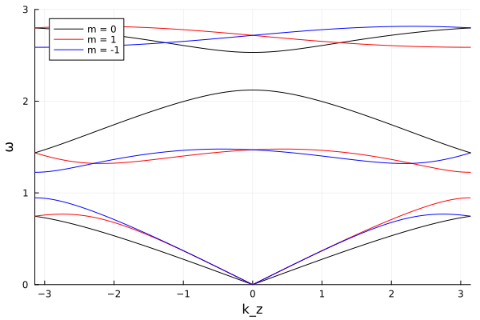

# phonon_Te
This repository reproduces the phonon calculations for tellurium-like helical crystals performed by Tsunetsugu et al. [1].

[1] H. Tsunetsugu, H. Kusunose, Theory of Energy Dispersion of Chiral Phonons, J. Phys. Soc. Jpn. 92 (2023) 023601.

# Usage
Prepare `main.cpp` and `plot.jl`, then execute `phonon.sh` (or manually run the commands contained in `phonon.sh`).
The plot of the calculation results is output as `phonon.png` like below.

# Disclaimer
This is an independent implementation for reproduction purposes. While I have made every effort to ensure the accuracy of the calculations, this repository is not officially affiliated with the original authors. Any discrepancies between these results and the original paper are the sole responsibility of the maintainer of this repository.